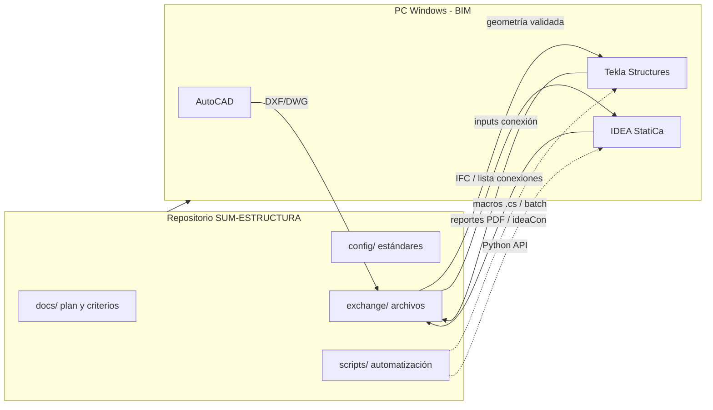

# Plan maestro — SUM-ESTRUCTURA

## Objetivo del proyecto

Modelar en **Tekla Structures** la estructura definida en planos de referencia (AutoCAD), generar **planos de fabricación y montaje**, y diseñar **conexiones no catalogadas** en **IDEA StatiCa**, con trazabilidad normativa y lista de materiales coherente.

## Alcance por fase

| Fase | Entregable principal | Herramienta | Responsable agente | Responsable humano |
|------|----------------------|-------------|--------------------|--------------------|
| 0 | Brief, normativa, criterios | Repo + docs | Redactar / mantener | Aprobar criterios |
| 1 | Layout 2D limpio, ejes, cotas | AutoCAD | Validar DXF, checklist | Dibujar / corregir en CAD |
| 2 | Modelo 3D, UDA, numeración | Tekla | Macros, listas, revisión IFC | Modelar en Tekla, ejecutar macros |
| 3 | Conexiones diseñadas | IDEA StatiCa | Plantillas, inputs, revisión resultados | Abrir IDEA, aprobar diseño |
| 4 | GA, fabricación, montaje | Tekla Drawings | Plantillas, reglas de dimensionado | Emitir y revisar planos |
| 5 | Paquete final + QA | Repo `exchange/` | Informe QA, pendientes | Firma / entrega |

## Qué puede y qué no puede el agente (Cursor Cloud)

| Capacidad | En la nube (este repo) | En tu PC Windows |
|-----------|------------------------|------------------|
| Leer/modificar **DXF** exportado | Sí (`scripts/dxf/`) | Sí (AutoCAD + librerías) |
| Leer **DWG** binario | Limitado (convertir a DXF) | Sí (AutoCAD API) |
| Abrir GUI de AutoCAD / Tekla / IDEA | No | Sí |
| Ejecutar **Tekla Open API** | No (requiere Tekla abierto) | Sí |
| Ejecutar **IDEA Connection REST API** | No (servicio local) | Sí |
| Generar macros, CSV, plantillas IDEA | Sí | Sí |
| Revisar IFC exportado, reportes | Sí (parcial) | Sí |

**Conclusión:** el agente **dirige el proyecto y produce artefactos**; la **ejecución BIM/CAD** ocurre en tu estación. El puente es la carpeta `exchange/` + commits en Git.

## Arquitectura de trabajo

## Plan de ejecución (orden obligatorio)

### Fase 0 — Arranque (bloqueante)

- [ ] Definir normativa (ej. CIRSOC / AISC / Eurocode según proyecto)
- [ ] Completar `config/nomenclatura.yaml` y `config/criterios-proyecto.yaml`
- [ ] Subir a `exchange/autocad/in/` el DWG/DXF de arquitectura o estructura de referencia
- [ ] Crear `exchange/tekla/model/` para copias de `.db1` / export IFC (no subir modelos enormes sin LFS si aplica)

### Fase 1 — AutoCAD (referencia 2D)

- [ ] Capas según `docs/02-CONFIGURACION-AUTOCAD.md`
- [ ] Ejes, niveles, vanos y secciones types en DXF limpio
- [ ] Exportar `SUM_layout_vXX.dxf` → `exchange/autocad/out/`
- [ ] Agente ejecuta validación DXF y genera `exchange/reports/dxf-validation.json`

### Fase 2 — Tekla (modelo 3D)

- [ ] Configurar entorno: acero, perfiles AR/LC según catálogo local
- [ ] Importar DXF como referencia o recrear con grilla Tekla
- [ ] Modelar: columnas, vigas, arriostres, correas, placas de base
- [ ] UDAs: fase, montaje, taller, norma
- [ ] Numeración piezas y ensambles coherente con `config/nomenclatura.yaml`
- [ ] Export IFC + lista de conexiones a `exchange/tekla/out/`

### Fase 3 — IDEA StatiCa (conexiones)

- [ ] Por cada nodo crítico: plantilla en `config/idea/connections/`
- [ ] Cargas de diseño alineadas con modelo Tekla (combinaciones)
- [ ] CBFEM + comprobaciones chapas, soldaduras, tornillos
- [ ] Entregar memoria de cálculo y `.ideaCon` en `exchange/idea/out/`

### Fase 4 — Planos Tekla

- [ ] GA (vistas, secciones, marcas)
- [ ] Fabricación (perfiles, placas, DXF para CNC si aplica)
- [ ] Montaje (planta, elevaciones, listado tornillería)
- [ ] Revisión cruzada modelo ↔ planos

### Fase 5 — Cierre

- [ ] Checklist `docs/05-FLUJO-ENTREGABLES.md`
- [ ] Informe QA en `exchange/reports/qa-cierre.md`

## Ritmo de iteración recomendado

1. **Commit pequeño** por hito (layout validado, modelo v1, conexión tipo 1, etc.)
2. El agente revisa `exchange/` en cada push
3. Reuniones de decisión solo para: cambios de criterio, perfiles no estándar, conexiones atípicas

## Riesgos y mitigaciones

| Riesgo | Mitigación |
|--------|------------|
| DXF sucio (bloques, unidades) | Script validación + capas estándar |
| Desfase Tekla ↔ IDEA | Lista maestra de nodos en CSV desde Tekla |
| Planos sin actualizar modelo | Regla: no emitir PDF sin `Model revision` UDA |
| Agente sin acceso a GUI | Runner local documentado en `scripts/local/README.md` |

## Próximo paso inmediato

Completar [06-REQUISITOS-Y-CHECKLIST.md](06-REQUISITOS-Y-CHECKLIST.md) y subir el **primer DXF/DWG** de la estructura a modelar.
