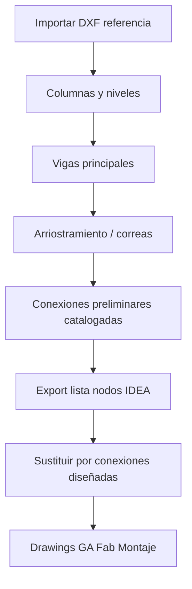

# Configuración Tekla Structures

## Objetivo

Modelo 3D de acero, listas de materiales, y planos **GA / fabricación / montaje**, alineados con el layout AutoCAD y las conexiones diseñadas en IDEA.

## Requisitos en tu PC

- Tekla Structures **Steel** con licencia activa
- Entorno y catálogo de perfiles acorde al país (ej. perfiles laminados AR)
- Carpetas del modelo apuntando al clone del repo: `...\SUM-ESTRUCTURA\tekla-models\` (local, opcional en Git)

## Configuración inicial del modelo

1. **Archivo → Configuración → Opciones**
   - Unidades: igual que AutoCAD (m)
   - Estándar acero según `config/criterios-proyecto.yaml`
2. **Grilla**: crear desde DXF importado o desde ejes documentados
3. **UDAs de proyecto** (crear en Administrador):

| UDA | Tipo | Uso |
|-----|------|-----|
| `SUM_FASE` | texto | FAB / MONTAJE |
| `SUM_NODO_IDEA` | texto | ID conexión en IDEA |
| `SUM_REVISION` | entero | Control de emisión |

4. **Numeración**: prefijos en `config/nomenclatura.yaml` (C=viga columna, V=viga, etc.)

## Flujo de modelado recomendado

## Open API (automatización local)

El agente puede generar plugins en `scripts/tekla/` (C#) que tú compilas y ejecutas con Tekla abierto.

Referencias (Tekla Developer Center):

- [Get started with Open API](https://developer.tekla.com/documentation/get-started-tekla-structures-open-api)
- Ensamblados: `Tekla.Structures.Model`, `Tekla.Structures.Drawing`

Casos típicos para SUM-ESTRUCTURA:

- Crear vigas entre puntos de grilla leídos de CSV
- Asignar UDAs masivamente
- Listar nodos en extremos de perfiles → CSV para IDEA
- Actualizar marcas en planos tras cambio de revisión

**Plantilla de proyecto:** ver `scripts/tekla/README.md`

## Import / export

| Formato | Dirección | Carpeta |
|---------|-----------|---------|
| DXF | AutoCAD → Tekla | `exchange/autocad/out/` |
| IFC | Tekla → revisión agente | `exchange/tekla/out/` |
| CSV nodos | Tekla → IDEA | `exchange/tekla/out/connection-nodes.csv` |
| Reporte BOM | Tekla → QA | `exchange/tekla/out/bom.xsr` o PDF |

## Planos de fabricación y montaje

### GA (General Arrangement)

- Vistas 3D + plantas por nivel
- Secciones críticas (conexiones IDEA referenciadas en nota)

### Fabricación

- Pieza única por plano o por fase de taller
- Cotas de workshop, chaflanes, taladros
- DXF de contorno para plasma/punzonado si aplica

### Montaje

- Planta con pesos y órdenes de montaje (`SUM_FASE`)
- Detalle de conexiones con tornillería aprobada

Plantillas de drawing: copiar desde modelo plantilla a `templates/tekla-drawings/` cuando existan.

## Control de calidad modelo

- [ ] Sin piezas no conectadas (análisis Tekla)
- [ ] Perfiles existen en catálogo
- [ ] Materiales y calidades definidos
- [ ] Cada nodo IDEA tiene `SUM_NODO_IDEA` en piezas adyacentes
- [ ] Revisión IFC sin colisiones graves
