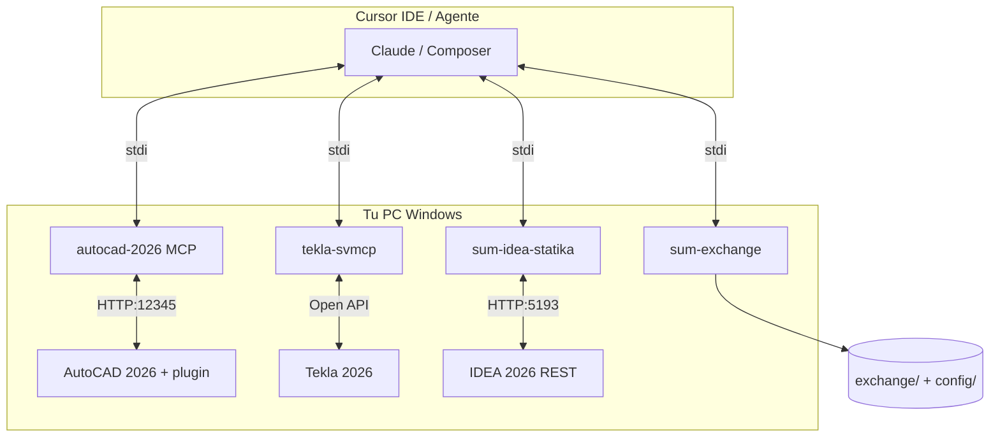

# Configuración MCP — SUM-ESTRUCTURA

Con **MCP (Model Context Protocol)** el agente en Cursor puede **leer y modificar** AutoCAD, Tekla e IDEA en tu PC, no en la nube. Los servidores corren en **localhost** junto a tus programas 2026.

## Arquitectura



| Servidor | Función | Requiere app abierta |
|----------|---------|----------------------|
| `sum-exchange` | Listar/validar DXF, leer normativa YAML | No |
| `autocad-2026` | 45+ tools geometría, capas, export DXF/PDF | AutoCAD 2026 + plugin NETLOAD |
| `tekla-svmcp` | Modelado, selección, componentes | Tekla 2026 |
| `sum-idea-statika` | Batch conexiones, health REST | IDEA + ConnectionRestApi |
| `tekla-openapi-docs` | Buscar ejemplos Open API | No (solo docs) |

## Instalación automática (Windows)

Desde la raíz del repo en **PowerShell como administrador** (solo la primera vez):

```powershell
Set-ExecutionPolicy -Scope CurrentUser RemoteSigned
.\scripts\setup\install-mcp-stack.ps1
```

Luego en Cursor: **Settings → MCP** → confirmar que aparecen los servidores (o copiar `mcp/mcp.windows.full.json` sobre `.cursor/mcp.json`).

## Instalación manual por componente

### 1. sum-exchange + sum-idea (Python)

```powershell
pip install -r mcp/requirements.txt
pip install -r scripts/requirements.txt
pip install ideastatica-connection-api
```

### 2. AutoCAD 2026 MCP

```powershell
git clone https://github.com/moisesbritez92/autocad-mcp.git vendor/autocad-mcp
cd vendor/autocad-mcp
npm install
npm run build
cd autocad-plugin
dotnet build -c Release
```

En AutoCAD 2026:

1. `NETLOAD` → `vendor\autocad-mcp\autocad-plugin\bin\Release\net8.0-windows\AutoCAD.MCP.Plugin.dll`
2. `setx MCP_AUTOCAD_TOKEN "default-secret-token"` y reiniciar AutoCAD
3. Ver mensaje: `[MCP] Server listening on http://localhost:12345/`

### 3. Tekla 2026 MCP (svMCP)

```powershell
git clone https://github.com/40ushek/svMCP.git vendor/svMCP
cd vendor/svMCP
dotnet build
```

Abrir **Tekla Structures 2026** antes de usar tools MCP. Si hay incompatibilidad de versión, usar Open API directo (`scripts/tekla/`) o [teknovizier/tekla_mcp_server](https://github.com/teknovizier/tekla_mcp_server) (probado en 2022).

### 4. IDEA StatiCa 2026

```powershell
& "C:\Program Files\IDEA StatiCa\StatiCa 26.0\IdeaStatiCa.ConnectionRestApi.exe" -port:5193
```

Ajustar ruta si tu instalación es `StatiCa 26.1`. El MCP `sum-idea-statika` usa el puerto `5193`.

## Archivos del proyecto en GitHub

El agente lee:

- `exchange/autocad/in/*.dwg` `*.dxf`
- `config/criterios-proyecto.yaml` (normativa CIRSOC, etc.)
- `exchange/normativa/` (PDF/MD si los subís)

Sincronizar tras cada push:

```powershell
git pull
python3 scripts/sync/ingest-github-assets.py
```

## Agente Cloud vs Cursor Desktop

| Entorno | MCP AutoCAD/Tekla/IDEA | Qué usar |
|---------|------------------------|----------|
| **Cursor Desktop** (tu PC) | Sí, localhost | Config completa `mcp.windows.full.json` |
| **Cloud Agent** | No llega a tu localhost | `sum-exchange` + archivos en `exchange/` vía Git |

Para Cloud + CAD en vivo: túnel (VPN/SSH port forward) o trabajar en **Cursor Desktop** con MCP.

## Comprobar que todo funciona

En Cursor, pedir al agente:

1. `list_exchange_files` con subfolder `autocad/in`
2. `idea_health` con Tekla/IDEA/AutoCAD abiertos
3. `validate_dxf` sobre tu layout

## Versiones del proyecto (2026)

| Software | Versión |
|----------|---------|
| AutoCAD | 2026 |
| Tekla Structures | 2026 |
| IDEA StatiCa | 2026 |

Registrado en `config/criterios-proyecto.yaml`.
